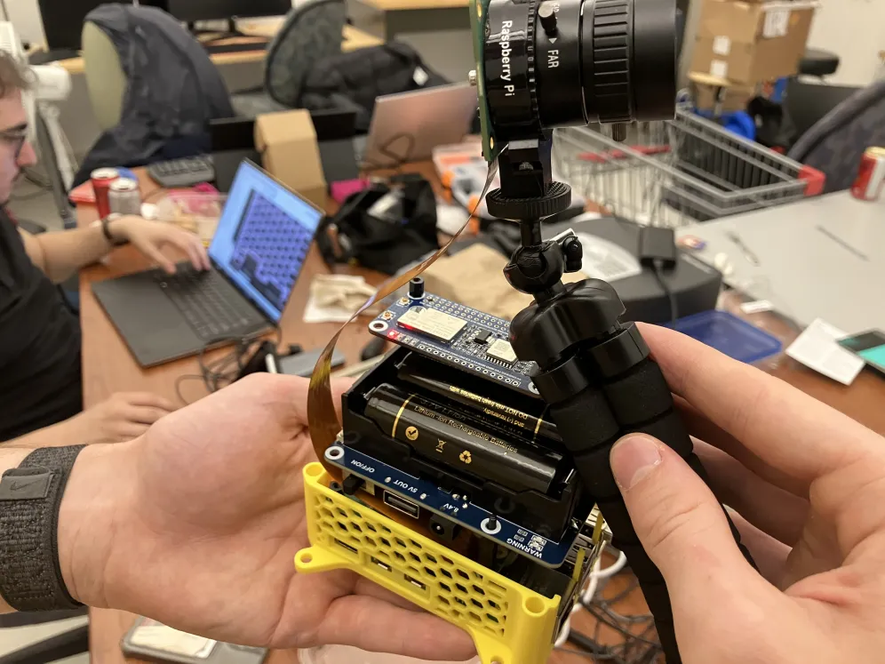

# T.A.I.L.S. (Tactical Aerial Insight and Localization Suite)

By Frederick Andrews, Jad Mghabghab, Josué Dazogbo, Maureen Kouassi, Mouad Ben lahbib, Computer Engineering Students at the University of Ottawa  
Date: 3 July 2025

  
  
<em>Figure 1: First field day group picture </em>

## Overview

**T.A.I.L.S.** (Tactical Aerial Insight and Localization Suite) is a drone-based **Point-of-Interest (POI)** mapping solution designed to enhance search and rescue operations, wildlife monitoring, and coastal surveillance.  

The system integrates **AI-powered image recognition** with **GPS tracking** to detect and mark important locations on an interactive map within a mobile application. This project involves expertise in **artificial intelligence**, **real-time embedded programming**, **wireless communication**, and **network security**.

  
  
<em>Figure 1: Assembled camera system mounted on top of a drone</em>

## Features
- 🧠 **AI Object Detection & POI Recognition**: Detect and classify objects of interest and transmit them as Points of Interest (POIs).  
- 🛰️ **Long Distance Telemetry Transmission**: Real-time, long-range communication of drone position and altitude.  
- 📱 **Mobile App Integration**: View past flight results, positions of recorded data points, and historical POIs directly in the app.

## Components

### On Board Node
The onboard module features a **Raspberry Pi 5**, **battery pack**, **LoRa-GPS module**, and a **Hailo AI hat** for accelerated inference. It uses a **Raspberry Pi Camera HQ** with a wide-angle lens to capture images, reads **GPS signals** from sensors, and creates **LoRa packets** for transmission.

  
  
<em>Figure 1: Custom adjustable mount for Raspberry Pi High Quality Camera</em>

<!-- 
- Add picture of the onboard node attached to the drone ideally while the drone is flying
- 

 -->

### Base Station
The base station utilizes a modified ESP32 named **Heltec LoRa board** supporting both **BLE** and **LoRa** communication. It receives **LoRa packets** from the drone and converts them into **BLE packets** to send to connected devices.

  
  
<em>Figure 1: Base station converting LoRa packet to appropriate BLE packet </em>

### App
The mobile application is built with **React Native** using **Expo Go** and **Firebase** for backend services. It displays **Points of Interest (POIs)** on a map, along with **flight data**, and is accessible on both **mobile devices** and the **web**.

  
  
<em>Figure 1: Mobile app developped for POI lookup and flight telemetry </em>

## Bill of Materials (BOM)

Below is a detailed list of hardware components used for the **TAILS Embedded System**, with all costs shown after tax.

### 🔧 Hardware Components

| Item Description | Quantity | Cost After Tax ($) |
|------------------|----------|---------------------|
| [Raspberry Pi Zero 2 W + AI Camera + Accessories](https://www.raspberrypi.com/products/raspberry-pi-zero-2-w/) | 1 | 240.01 |
| [Raspberry Pi 5 (16GB) + Accessories](https://www.pishop.ca/product/raspberry-pi-5-16gb/?src=raspberrypi) | 1 | 304.30 |
| [Raspberry Pi HQ Camera + Lens](https://www.raspberrypi.com/products/ai-camera/) | 1 | 137.24 |
| [USB to LoRa Dongle](https://www.pishop.ca/product/usb-to-lora-dongle-915-mhz/) | 1 | Included Above |
| [Heltec LoRa Board (Base Station)](https://www.amazon.ca/-/fr/gp/product/B086ZFCV7F?smid=A2RJ79XBQX6W3M&psc=1) | 1 | 41.69 |
| [SX1262 LoRa Hat](https://www.amazon.ca/SX1262-LoRaWAN-GNSS-HAT-Expansion/dp/B0D4DPB68J) | 1 | 52.93 |
| [AI Accelerator Hat (Hailo-8L)](https://hailo.ai) | 1 | 123.06 |
| [PHAT-GPM GPS Module](https://canada.newark.com/designer-systems/phat-gpm/gps-module-raspberry-pi-rohs-compliant/dp/45AJ6805) | 1 | 55.99 |
| [Raspberry Pi UPS Power HAT](https://www.pishop.ca/product/uninterruptible-power-supply-ups-hat-for-raspberry-pi-zero-stable-5v-power-output/) | 1 | 77.79 |
| [Adjustable Camera Mount](https://www.pishop.ca/product/universal-tilt-adjustable-mount-for-raspberry-pi-camera/) | 1 | 35.65 |
| Drone Parts (Motors, Frame, ESC, etc.) | — | 754.77 |
| Accessories (Cables, spacers, mounts, etc.) | — | 159.67 |
| [Drone Assembly Fee (StansUAV)](https://stansuav.ca/) | 1 | 339.00 |
| **Total Project Cost** | — | **2,322.10** |

